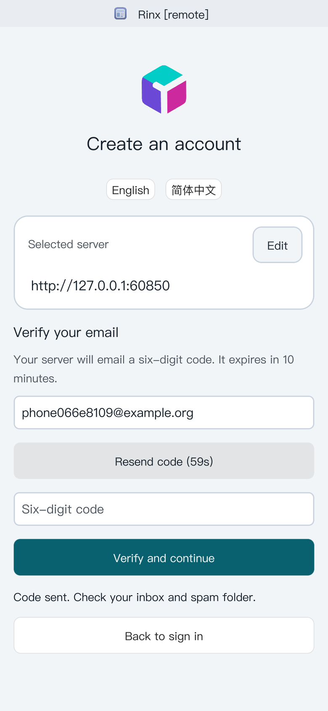
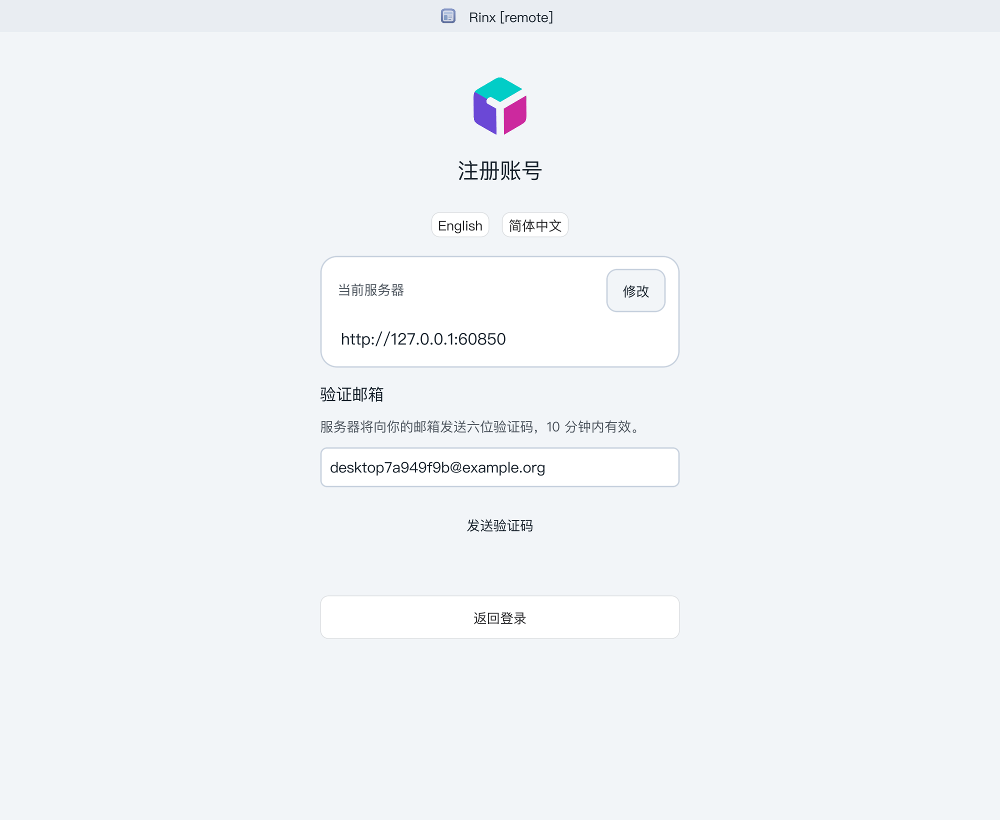

# Native email verification

When the selected Palpo server requires email verification, **Create an account**
opens a native email step shared by desktop and mobile:

1. Enter your email address and select **Send verification code**.
2. Enter the six-digit code from the latest email and select **Verify and continue**.
3. Choose your username and password. Enter an invitation token if your server
   requires one, then select **Create account**.

The code expires after ten minutes. Resend becomes available after sixty seconds;
resending invalidates the earlier code. Five wrong guesses lock that code.
**Change email** clears the proof and password. Changing servers or leaving the
registration flow also discards the proof. A verified email is valid for thirty
minutes and one account. Correcting an invitation token keeps the same registration
session, so you do not need another email for that correction.

Palpo advertises `org.palpo.registration.email_otp` through Matrix `/versions`.
Rinx requests and verifies codes only on that selected homeserver and submits the
standard `m.login.email.identity` UIAA credentials along with any invitation stage.
AgentMail keys belong exclusively on Palpo. Other servers retain their advertised
native or browser registration methods; this feature does not replace matrix.org's
browser verification or implement the separate administrator-approval workflow.

## Validation

```sh
cargo test --locked --lib login::
python3 tools/wechat-ux/check_i18n.py
cargo build --locked --bin rinx
```

For full native acceptance, run Palpo's `tests/registration_email_otp.py --serve`
with an isolated PostgreSQL database and its recording AgentMail transport, then:

```sh
python3 tools/wechat-ux/live/native_email_registration.py \
  --binary target/debug/rinx \
  --state /path/to/palpo/target/email-otp-test/state.json \
  --output target/native-email-acceptance
```

This drives hidden native Mac windows at desktop and phone sizes with separate
profiles. It checks send/verify, errors, change-email invalidation, translated copy
and account creation, and writes screenshots and a JSON report. Phone-size native
Mac testing is not physical Android/iOS keyboard or autofill validation.

## Native acceptance, 2026-10-07

19 login tests passed, including combined email/invitation UIAA and invitation
retry. The translation catalog has no missing entries. Native Mac acceptance
passed at 1000×820 and 390×844 logical pixels against a real isolated Palpo server:
request code, handle an incorrect code, verify, change email, switch language,
create an account with an invitation, and enter the signed-in chat interface.




